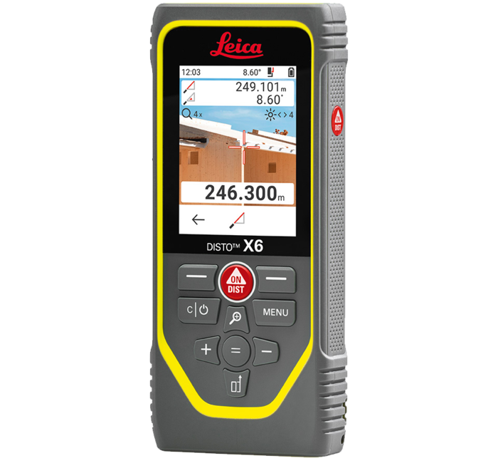

# Disto X6-Speleo

The “paperless system” is an integrated electronic cave surveying tool. It consists of two parts: A combined Disto/compass/clinometer and a mobile based app to store and manage the measured data and to draw sketches directly on the screen.

The two devices are connected by a wireless Bluetooth connection. Measurements are visible on the mobile app screen within seconds. Results can be transferred to PC based cave surveying applications and graphics editors.

# Status

The project has started in 2023. Development and intense testing has to be done.

## Introduction

The DistoX2 from Beat Heeb based on Lica Disto X310 is obsolete by 2023. The responsibility for future development and distribution has been transferred to Simon Ziegler (AGH) and Andreas Münger (OGH).

The new Disto-X6 speleo will be based on the Leica Disto X6. The speleo edition is the Lica Disto X6 with the additional electronics for the cave topography.

## Full Documentation

TODO

## Communication

TODO

## What does it do?

TODO

## Dashboard

TODO

## Bugs and Feedback

TODO

## LICENS

TODO
